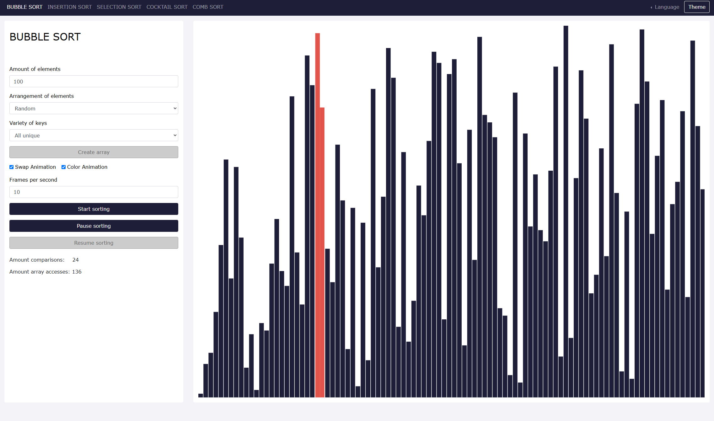

# Sorting Algorithm Visualization

This is a small project about sorting algorithms that I did in school. It animates and visualises sorting algorithms like bubble sort, insertion sort, selection sort and so on. A lot of popular algorithms like quick sort are missing, they were just out of scope at that time.

# ⚖ License

This project is licensed under the MIT License - see the [LICENSE](LICENSE) file for more details.
